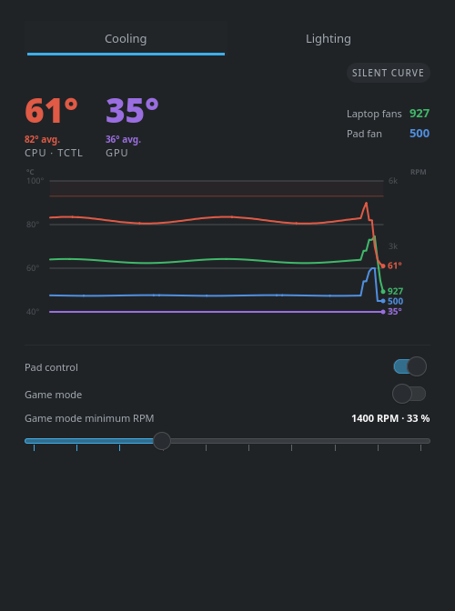
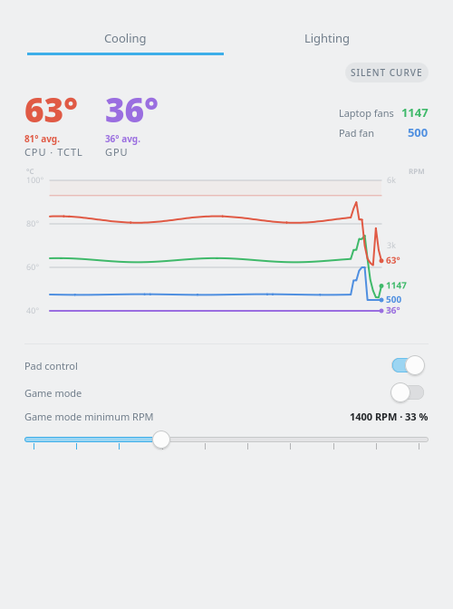

# cooling-ctl — Cooling Control

A single, quiet, signal-driven control stack for the **Razer Laptop Cooling
Pad** on Linux, built around a **Framework Laptop 16 (AMD)** but not limited
to it — plus a **KDE Plasma 6 plasmoid** to watch and drive everything.

Two pieces, one package:

- **`coolingctld`** — a *user* systemd daemon that owns the pad's HID
  interface exclusively, applies a silent fan curve (or a fixed gaming
  plateau) to it, and switches modes **via POSIX signals, with no restarts**.
- **Cooling Control plasmoid** (`org.coolingctl`) — CPU/GPU temperatures with
  rolling averages, internal fan speeds, pad RPM, a 4-series chart, and live
  controls (pad control switch, game mode switch, stepped RPM slider).

| | Dark | Light |
|---|---|---|
| **Full view** |  |  |
| **Panel view** |  |  |

*Full view — hero temperatures with rolling averages, 4-series chart, pad
control and game mode switches, game mode minimum RPM slider.
Panel view — GPU/CPU temperatures and load, with the load-paced cat.*

## Why

Stock, the pad is either off or loud, and switching strategies usually means
killing and restarting a controller (dropping the device, racing with the
game, etc.). This project takes the opposite stance:

- **One owner**: the daemon holds the pad's HID interface exclusively;
  everything else reads its atomic status file. No journal scraping, no
  concurrent writes.
- **No restarts, ever**: mode changes are signals (`SIGUSR1`, `SIGUSR2`,
  `SIGWINCH`), config reloads are `SIGHUP`. A game can flip the pad into its
  gaming plateau the moment it launches — and back when it crashes — through
  gamemode hooks.
- **Silence first**: the default curve keeps the pad at its 500 RPM floor
  until the SoC actually gets hot, trading a ~1 °C Tctl increase for a large
  noise reduction (validated in real gaming sessions on a Ryzen 9 7940HS).

The RPM → hardware mapping is linear: `500 + percent × 27`, capped at
3200 RPM (pad firmware steps of ~50 RPM).

## Requirements

- KDE **Plasma 6** (plasmoid), Python 3 with `python-hidapi` (daemon)
- A **Razer Laptop Cooling Pad** (USB VID/PID `1532:0f43`)
- An AMD SoC exposing **k10temp** (sensor auto-detected from
  `/sys/class/hwmon/`); the plasmoid additionally reads the internal fan
  speeds and dGPU/iGPU temperatures — see the hardware scope note below
- A udev rule granting user access to the pad (shipped below)

## Installation

### Arch Linux

```sh
makepkg -si
```

or from the sources in this repository. An AUR package is planned.

The package installs:

| Path | Content |
|---|---|
| `/usr/share/plasma/plasmoids/org.coolingctl/` | plasmoid |
| `/usr/lib/cooling-ctl/coolingctld.py` | daemon |
| `/usr/lib/systemd/user/coolingctl.service` | user unit |
| `/usr/lib/udev/rules.d/99-razer-coolingpad.rules` | pad access without root |

### Other distributions

Copy the same four pieces to the equivalent paths (plasmoid dir, an executable
daemon, `~/.config/systemd/user/`, `/etc/udev/rules.d/`) and reload udev:

```sh
sudo udevadm control --reload && sudo udevadm trigger
```

## Setup

```sh
# enable the user service
systemctl --user enable --now coolingctl.service
```

Create the configuration (the daemon reads two JSON files from
`~/.config/coolingctl/`, reloadable with `SIGHUP`):

`~/.config/coolingctl/silent-curve.json` — temperature → percent curve,
evaluated by linear interpolation, sampled every `interval` seconds:

```json
{
    "curve": [
        { "temp": 0,  "percent": 0 },
        { "temp": 76, "percent": 20 },
        { "temp": 85, "percent": 35 },
        { "temp": 98, "percent": 100 }
    ],
    "interval": 3,
    "hysteresis": 2,
    "sensors": "auto"
}
```

`~/.config/coolingctl/gaming-plateau.json` — a flat curve; its **first point's
percent** is the game mode fan floor: in game mode the pad never runs below
this speed, so a constant airflow slows the heat-up during play:

```json
{
    "curve": [
        { "temp": 0,   "percent": 33 },
        { "temp": 120, "percent": 33 }
    ],
    "interval": 3,
    "hysteresis": 2,
    "sensors": "auto"
}
```

The plasmoid's slider adjusts this plateau live (`set-plateau` + `SIGHUP`).
The `"sensors": "auto"` key is inert — the daemon always resolves `k10temp`
itself, precisely to avoid broken ACPI thermal zones.

### Optional: gamemode integration

In `~/.config/gamemode.ini`, hook the daemon's signals so games switch the pad
automatically (works even if the game crashes — gamemoded tracks the PID):

```ini
[custom]
start="systemctl --user kill --signal=SIGUSR1 coolingctl.service"
end="systemctl --user kill --signal=SIGUSR2 coolingctl.service"
```

Use the `[custom]` section, not `[scripts]` (which gamemode ignores).

## Modes & signals

| Signal | Mode | Behavior |
|---|---|---|
| `SIGUSR1` | game | fixed plateau, held in daemon memory (JSON files re-read on `SIGHUP`) |
| `SIGUSR2` | curve | silent curve against k10temp |
| `SIGWINCH` | free | releases control, pad firmware decides |
| `SIGHUP` | (reload) | re-reads both config files, mode unchanged |

```sh
systemctl --user kill --signal=SIGUSR1 coolingctl.service
```

Live state is published atomically at each loop iteration (3 s) in
`$XDG_RUNTIME_DIR/coolingctl.status`:

```
mode=silent
temp=62.0
plateau_pct=33
plateau_rpm=1391
rpm_cmd=1391
rpm_reported=1400
pad_present=1
```

If the pad is absent, the daemon waits quietly and reconnects on its own;
repeated failed reads trigger a device re-open. The plasmoid mirrors this:
no pad → no pad series, no errors.

## Plasmoid

- **Panel (compact) view**: rolling-average CPU (orange) and GPU (purple)
  temperatures, per-component load, and an animated walking cat whose pace
  follows the load — replacing a temperature widget, a CPU monitor and a
  decorative pet in one.
- **Popup (full) view**: hero temperatures with rolling averages, a 4-series
  chart (CPU temp, GPU temp, internal fans, pad RPM) with anti-collision
  labels and a 93 °C threshold band, pad control and game mode switches, and
  a stepped game mode minimum RPM slider (500→3200 in 300 RPM steps, snapped
  handle, commit on
  release, self-resyncing).

The helper `coolingctl.sh status` returns 9 pipe-separated machine-readable
fields: `tctl|fan1|fan2|pad_rpm|mode|plateau_pct|gpu|cpu|gpu_pct`;
`set-plateau <pct>` and `mode <game|silent|free>` perform actions.

**Hardware scope note**: the pad control and curve engine are generic, but the
helper's sensor discovery (internal fans via the Framework's `cros_ec`, dGPU
vs iGPU discrimination via PCI addresses) is written for the Framework 16
layout. On other AMD laptops the daemon and pad control work as-is; the
plasmoid's internal-fan and GPU-load readouts may need adaptation.

## Development

The quality and packaging pipeline is exposed via `make` targets; the
screenshots are regenerated from the real widget by `tools/capture-screenshots.sh`: `make test`
(full suite), `make lint`, `make smoke` (plasmoid load gate, requires an
installed copy), `make pkg` (Arch package), `make check` (pre-release gate).

```sh
cd tests
./run.sh            # unit + helper + structure + integration + QML + lint
SKIP_INTEGRATION=1 ./run.sh   # skip live-daemon tests
RUN_SMOKE=1 ./run.sh          # + plasmoid load smoke test (plasmawindowed)
COOLINGCTL_PYTHON=/path/bin/python ./run.sh  # interpreter providing `hid`
COOLINGCTL_REFERENCE=/path/razer-coolingpad-fancurve.py ./run.sh
                              # + HID protocol parity tests (optional)
```

- QML logic (compact view) is unit-tested via `qmltestrunner` (Qt 6);
  structural tests encode regressions actually hit during development
  (expanded state, panel layout hints, QQC2 slider handler validity, …);
  integration tests run against the live daemon; the HID protocol parity
  suite requires a local copy of the reference controller and is skipped
  otherwise.
- House rule: a new test only lands once it has been shown to fail against
  the bug it targets (mutation-checked), so the suite keeps biting.

## License & credits

This project is licensed under the **GPL-2.0-or-later** (see `LICENSE`).

The animated cat in the panel view — the `my-active-*-symbolic.svg` frames
and the pacing formula in `contents/ui/compact-logic.js` — is taken from the
**CatWalk** plasmoid by **Yuri Saurov** (GPL-2.0-or-later). Those frames
themselves carry RunCat titles in their metadata and trace back to the
**RunCat** project by Takuto Nakamura (current upstream RunCatNeo is
Apache-2.0) — credit for the running cat ultimately goes to them.

The HID protocol used by the daemon follows the reverse-engineered
`razer-coolingpad-linux` / `razer-coolingpad-fancurve` work of the community
around the Razer Laptop Cooling Pad.

Measured thermal behavior quoted above was established on a Framework
Laptop 16 (Ryzen 9 7940HS, RX 7700S) under Linux; defaults are sensible but
you should tune the curve to your own machine.
